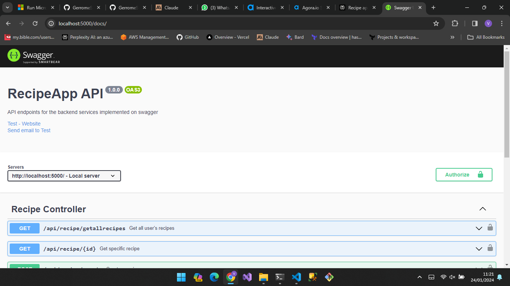

# Recipe App 

The Recipe App is a Node.js/Express.js REST API designed to create, save, and share food recipes. MongoDB is used as the database to store and manage the recipe data. The app allows users to perform various operations on the recipes, such as creating, reading, updating, and deleting them.

## Features

- User authentication system with login/register
- JWT tokens for API authentication
- CRUD functionality for users
- CRUD functionality for recipes 
- Swagger/OpenAPI documentation for API

## Usage

### Install Dependencies

yarn install

### Run Development Server

yarn start

## API Documentation

Swagger API schema and documentation available at:

http://localhost:5000/docs

